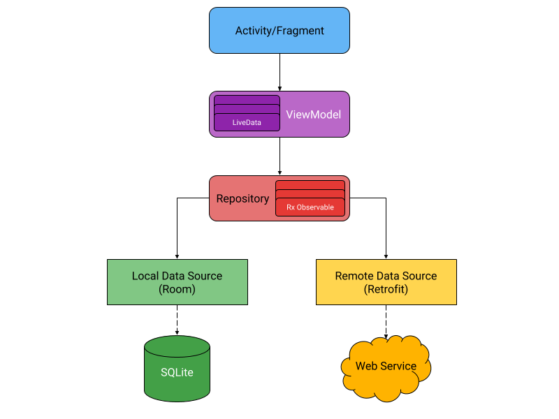

# Android-Kotlin-MVVM-Starter

Android MVVM Architecture using Kotlin

# Kotlin and Android

# MVVM Architecture

Below is the technology included
- Room
- LiveData
- ViewModel
- Retrofit
- Navigation
- Kodein
- Coroutines
